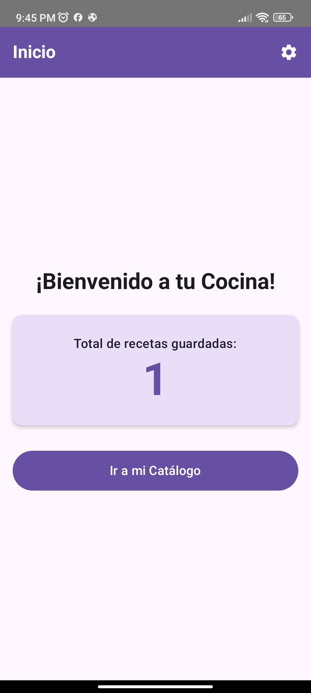
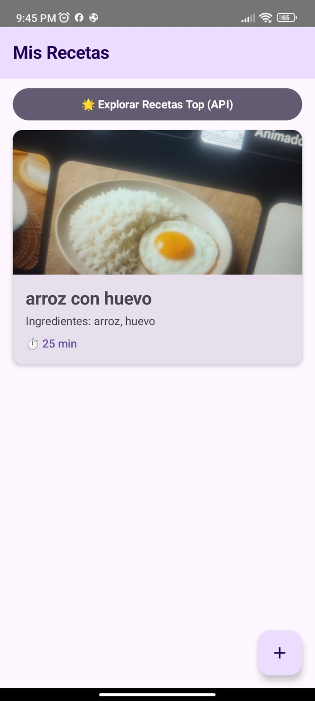
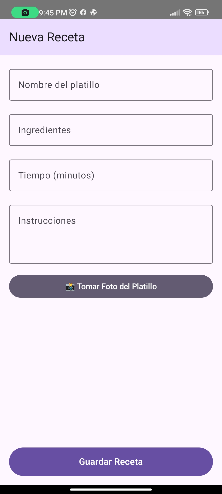
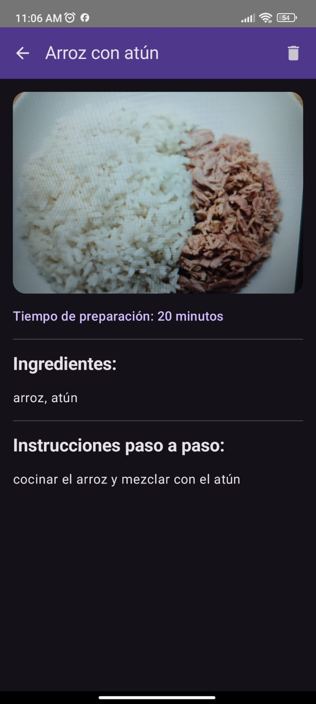
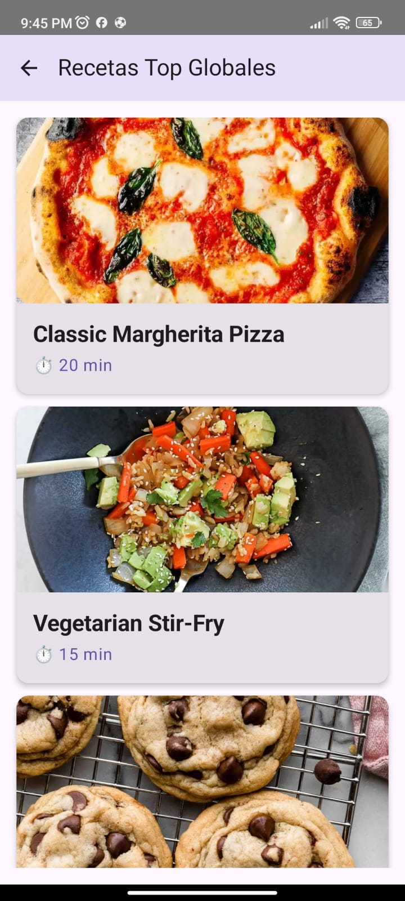
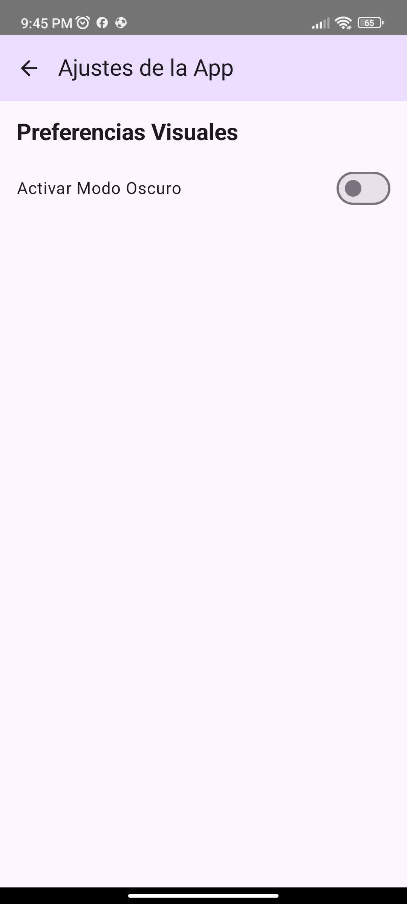
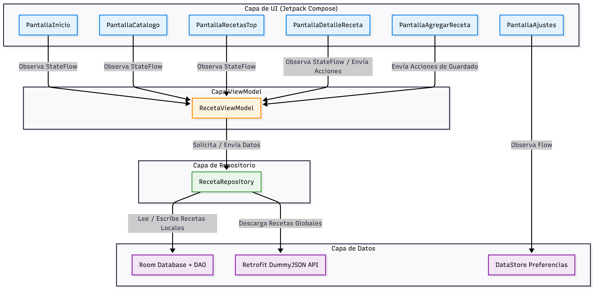

# Manual de Usuario — Mis Recetas App 👩‍🍳👨‍🍳

## 1. Introducción 🌟

¡Hola y bienvenidos a tu nueva cocina digital! Nos alegra mucho presentarles "Mis Recetas", tu compañero ideal en el mundo culinario.

**¿Qué es "Mis Recetas"?**

"Mis Recetas" es una aplicación móvil amigable y fácil de usar, diseñada específicamente para dispositivos Android. Su objetivo principal es ayudarte a guardar, organizar y gestionar todas tus recetas de cocina favoritas de manera sencilla. ¿Alguna vez has perdido ese papelito donde anotaste la receta de la abuela? ¡Eso ya no sucederá! Con esta app podrás:

- Guardar tus propias recetas de forma segura.
- Agregar fotos de los deliciosos platillos que preparas.
- Explorar un mundo de recetas globales obtenidas desde internet para cuando necesites inspiración.
- Personalizar el aspecto visual de la aplicación para que se adapte a tus gustos y necesidades.

**Autoría y Origen**

Esta hermosa aplicación ha sido desarrollada con mucha dedicación por **Ney Jurado**, como parte fundamental de su Proyecto Final de Aplicaciones Móviles. Ha sido construida pensando siempre en la comodidad y facilidad de uso para cualquier persona, desde el cocinero principiante hasta el experto del hogar.

> [!TIP]
> **Consejo para iniciar**
> ¡Anímate a explorar! La aplicación está diseñada para ser intuitiva, así que no dudes en presionar botones y descubrir todo lo que tiene para ofrecerte.

---

## 2. Requisitos del Dispositivo 📱

Para asegurar que "Mis Recetas" funcione de manera fluida y sin problemas, tu teléfono o tablet debe cumplir con algunos requisitos básicos. ¡No te preocupes, son muy comunes en los teléfonos actuales!

- **Sistema Operativo:** Android 10 (API 29) o una versión superior. Si tu teléfono tiene menos de 4 años, ¡seguro que es compatible!
- **Cámara:** (Opcional) Necesaria si deseas tomar fotos de tus platillos directamente desde la app. Si tu dispositivo no tiene cámara o no quieres usarla, no hay problema, puedes guardar recetas sin foto.
- **Conexión a Internet:** Requerida únicamente para la sección especial de "Recetas Top", donde descargamos inspiración global para ti. ¡El resto de la app funciona perfectamente sin conexión (offline)!
- **Almacenamiento:** Un espacio mínimo (menos de 50 MB) para instalar la app y guardar tu base de datos local con las recetas.

---

## 3. Instalación 📥

Instalar "Mis Recetas" en tu dispositivo Android es un proceso rápido. Aquí te guiamos paso a paso para que comiences a disfrutarla en pocos minutos.

### Pasos para instalar la aplicación:

1. **Obtener el archivo APK:** Descarga o recibe el archivo instalador de la aplicación, el cual tiene extensión `.apk`.
2. **Permitir la instalación:** 
   - Por razones de seguridad, Android bloquea inicialmente las aplicaciones que no provienen de la tienda oficial (Google Play Store). 
   - Para continuar, debes habilitar la opción de **"Orígenes desconocidos"** o **"Instalar aplicaciones desconocidas"**. 
   - Dependiendo de tu teléfono, esto suele encontrarse en: `Configuración > Seguridad > Instalar apps desconocidas`.
3. **Instalar el archivo:**
   - Busca el archivo `.apk` descargado (usualmente en la carpeta de "Descargas" o "Downloads").
   - Toca el archivo para abrirlo.
   - Te aparecerá un mensaje preguntando si deseas instalar la aplicación. Toca **"Instalar"**.
4. **¡Listo!** Espera unos segundos a que finalice el proceso y luego toca **"Abrir"** para iniciar la aplicación por primera vez.

> [!NOTE]
> **Nota de Seguridad**
> Es completamente normal que el teléfono te pida confirmación antes de instalar una app mediante un APK. "Mis Recetas" es una aplicación segura creada para este proyecto académico.

---

## 4. Permisos de la Aplicación 🔐

Para que "Mis Recetas" te brinde la mejor experiencia posible, en ciertas ocasiones te pedirá acceso a algunas funciones de tu teléfono. Somos muy cuidadosos con tu privacidad, y aquí te explicamos para qué usamos cada permiso:

- **Cámara 📸:** 
  - **¿Para qué sirve?** Para permitirte tomar fotos espectaculares de tus platillos justo en el momento de agregar una nueva receta.
  - **¿Cuándo se solicita?** Solamente en el momento en que intentes tomar una foto por primera vez.
  - **¿Qué pasa si digo que no?** ¡No hay problema! Si rechazas el permiso de la cámara, la aplicación seguirá funcionando de maravilla, simplemente tus nuevas recetas no tendrán la foto del platillo.

- **Internet 🌐:**
  - **¿Para qué sirve?** Para conectarse a la red y descargar las recetas globales de nuestra sección "Recetas Top".
  - **¿Es obligatorio?** No. Este permiso no requiere que tú lo apruebes manualmente; el teléfono lo gestiona. Si no tienes conexión a internet (por ejemplo, si estás en modo avión), simplemente no podrás ver las "Recetas Top", pero **sí** podrás seguir viendo, creando y editando todas tus recetas locales sin ninguna interrupción.

---

## 5. Pantalla de Inicio 🏠

Al abrir la aplicación, te recibiremos con una pantalla amigable y motivadora. Esta es tu central de mando.

**Elementos que encontrarás aquí:**

1. **Saludo de Bienvenida:** Un alegre "¡Bienvenido a tu Cocina!" te esperará cada vez que abras la app para inspirarte a cocinar.
2. **Tarjeta Resumen:** En el centro de la pantalla, verás una tarjeta muy útil que te indica el **número total de recetas** que has guardado en tu dispositivo hasta el momento. ¡Es gratificante ver cómo crece tu colección!
3. **Botón Principal:** Un botón grande y claro con el texto **"Ir a mi Catálogo"**. Al tocarlo, te dirigirás directamente a la lista donde están todas tus recetas guardadas.
4. **Ajustes:** En la esquina superior derecha, encontrarás un **ícono de engranaje (⚙️)**. Tocar este ícono te llevará a la pantalla de Ajustes, donde podrás personalizar tu aplicación.

---

## 6. Catálogo de Recetas 📋

¡Aquí es donde reside la magia de tu recetario personal! El Catálogo es el lugar donde puedes ver y gestionar todas las preparaciones que has ido guardando a lo largo del tiempo.

**¿Qué puedes hacer en esta pantalla?**

- **Ver tu Lista de Recetas:** La pantalla muestra una lista vertical con todas las recetas que has guardado. Puedes deslizar hacia arriba y hacia abajo para navegar por ellas.
- **Información Rápida:** Cada receta se muestra en una "tarjeta" que resume lo más importante para que la identifiques de un vistazo:
  - La **foto** de tu platillo (si decidiste tomarle una).
  - El **nombre** delicioso de la receta.
  - Los **ingredientes** (se muestran solo las primeras dos líneas para no ocupar mucho espacio).
  - El **tiempo de preparación** estimado, para que sepas si tienes tiempo de cocinarla.
- **Ver Detalles:** ¿Quieres saber cómo se prepara? Simplemente **toca cualquier tarjeta** y te llevaremos a la pantalla de detalle para leer todas las instrucciones.
- **Inspiración Global:** En la parte superior encontrarás un botón muy especial: **"🌟 Explorar Recetas Top (API)"**. Al tocarlo, la aplicación buscará recetas populares en internet para darte nuevas ideas.
- **Agregar Nueva Receta:** En la esquina inferior derecha, verás un botón flotante con el símbolo **"+"**. Este es tu botón mágico para añadir una nueva creación culinaria a tu colección.

---

## 7. Agregar una Nueva Receta ➕

¿Acabas de inventar un platillo increíble o tu mamá te pasó su receta secreta? ¡Es hora de guardarla! Al tocar el botón "+" en el catálogo, llegarás a este formulario.

**¿Cómo llenar el formulario?**

1. **Nombre del platillo:** Escribe el nombre de tu obra maestra culinaria. (Ejemplo: "Lasaña de la Abuela"). *Este campo es obligatorio.*
2. **Ingredientes:** Anota todo lo que necesitas comprar o tener a mano. Puedes hacerlo en forma de lista o un párrafo, como te sea más cómodo.
3. **Tiempo (minutos):** ¿Cuánto tardarás en cocinar esto? Ingresa el tiempo en minutos (solo puedes escribir números, ejemplo: 45). *Este campo es obligatorio.*
4. **Instrucciones:** Explica paso a paso cómo se prepara. Sé lo más detallado posible para que la próxima vez te quede igual de delicioso.

**Añadiendo una Foto:**

- Toca el botón **"📸 Tomar Foto del Platillo"**.
- Si es tu primera vez, la aplicación te pedirá permiso para usar la cámara. Toca "Permitir".
- Se abrirá la cámara de tu dispositivo. Enfoca tu platillo y toma la foto.
- Confirma que la foto te gusta.
- Verás que el botón en la aplicación cambia a **"✅ ¡Foto Capturada!"**, lo que significa que tu imagen está lista para guardarse junto con tu receta.
- *(Recuerda: si rechazas el permiso, verás un mensaje que dice "Permiso denegado" y no podrás agregar la foto).*

**Guardar:**

- Una vez que hayas completado la información, desliza hasta el final y toca el botón **"Guardar Receta"**. ¡Listo! Tu receta ha sido añadida a tu catálogo para siempre.

> [!WARNING]
> **No olvides**
> Necesitas rellenar obligatoriamente el **Nombre** y el **Tiempo** para poder guardar la receta. Si te falta alguno, la aplicación te avisará sutilmente para que lo completes.

---

## 8. Detalle de una Receta 📖

Cuando tocas una tarjeta en tu catálogo, llegas a la pantalla de Detalle. Aquí es donde te pones el delantal y empiezas a cocinar, ya que tienes toda la información a la vista.

**¿Qué información encontrarás?**

- **La Foto de tu Platillo:** Si tomaste una foto, aparecerá en la parte superior en un tamaño grande para que te abra el apetito.
- **Tiempo de Preparación:** Se mostrará de manera destacada para que recuerdes cuánto tiempo necesitas dedicar.
- **Ingredientes Completos:** Toda la lista que escribiste, lista para que la revises antes de empezar.
- **Instrucciones Paso a Paso:** El corazón de la receta, mostrado claramente para que lo sigas mientras cocinas.

**Acciones disponibles en esta pantalla:**

- **Regresar:** En la esquina superior izquierda, verás un botón de flecha (←). Tócalo si deseas volver a tu catálogo principal sin hacer cambios.
- **Eliminar Receta:** En la esquina superior derecha, encontrarás un **ícono de papelera (🗑️)**.
  - **⚠️ CUIDADO:** Al tocar este botón, la receta se **eliminará permanentemente** de tu base de datos y regresarás automáticamente al catálogo. Úsalo solo si estás completamente seguro de que ya no necesitas esa receta.

---

## 9. Recetas Top (Internet) 🌍

¿Te quedaste sin ideas? ¡La sección "Recetas Top" viene a tu rescate! Esta pantalla obtiene ideas globales increíbles de internet.

**¿Cómo funciona?**

- Al tocar "🌟 Explorar Recetas Top (API)" en el catálogo, accederás a esta sección.
- **Mientras carga:** Verás un indicador circular girando de manera amigable, lo que significa que estamos buscando en internet las mejores recetas para ti (conectándonos a la API DummyJSON).
- **Si no hay internet:** ¡No te asustes! Si tu teléfono no tiene conexión en ese momento, aparecerá una tarjeta roja con un mensaje de error explicándote la situación. También verás un botón de **"Reintentar conexión"** para que vuelvas a intentar cuando recuperes el Wi-Fi o tus datos móviles.
- **Cuando carga exitosamente:** Aparecerá una hermosa lista de tarjetas. Cada tarjeta muestra la foto atractiva, el nombre y el tiempo de preparación de una receta de internet.

**Navegación Interactiva:**

- **Tarjetas Expandibles:** ¿Te llama la atención alguna receta? **Toca la tarjeta**. Se expandirá hacia abajo, revelando al instante los ingredientes y las instrucciones completas de esa receta global. Si quieres ocultar los detalles, **vuelve a tocar la tarjeta** y se contraerá.
- **Regresar:** Toca el botón de flecha (←) en la parte superior para volver a tu catálogo seguro de recetas locales.

> [!NOTE]
> Las recetas que ves en esta sección se descargan en el momento. **No se guardan en tu teléfono**. Esto significa que cada vez que entres (y tengas internet), podrías encontrar información nueva y fresca, ¡pero no ocuparán espacio en tu memoria!

---

## 10. Ajustes ⚙️

En "Mis Recetas" queremos que te sientas a gusto, por eso te ofrecemos la posibilidad de personalizar cómo se ve la aplicación. A esto puedes acceder desde el ícono de engranaje en la Pantalla de Inicio.

**Opciones de Personalización:**

- **Modo Oscuro (Dark Mode):** 
  - Verás un interruptor (Switch) etiquetado como "Modo Oscuro".
  - **Activar:** Si tocas el interruptor para activarlo, mágicamente **toda la aplicación** cambiará a una paleta de colores oscuros. Esto es ideal para cocinar de noche o simplemente para descansar la vista.
  - **Desactivar:** Si lo apagas, la aplicación volverá a sus colores claros y luminosos tradicionales.
  - **Memoria:** Lo mejor de todo es que esta preferencia se **guarda permanentemente** en tu dispositivo. Si cierras la aplicación o reinicias el teléfono, cuando vuelvas a abrir "Mis Recetas", recordará si prefieres el modo oscuro o el modo claro.

- **Regresar:** Como siempre, un botón de flecha (←) en la parte superior te permitirá volver al Inicio.

---

## 11. Preguntas Frecuentes (FAQ) ❓

Sabemos que puedes tener algunas dudas al usar la aplicación. Hemos recopilado las preguntas más comunes para ayudarte rápidamente:

| Pregunta 🤔 | Respuesta 💡 |
|-------------|--------------|
| **¿Se pierden mis recetas si cierro la app?** | ¡Para nada! Todas tus recetas se guardan de forma segura en una base de datos local (dentro de tu dispositivo). Permanecerán allí sanas y salvas hasta que decidas borrarlas tú mismo manualmente. |
| **¿Necesito internet para usar la app?** | No para las funciones principales. Puedes guardar, ver, editar y borrar tus recetas totalmente sin conexión. Solo necesitas internet exclusivamente para usar la sección "Recetas Top", donde buscamos inspiración en la red. |
| **¿Por qué la app me pide permiso de cámara?** | Única y exclusivamente para permitirte tomar fotos de los platillos que preparas cuando agregas una nueva receta. Si rechazas el permiso, la app sigue funcionando maravillosamente, simplemente no podrás agregar fotos. Tu privacidad es importante. |
| **¿Puedo recuperar una receta borrada?** | Lamentablemente, no. Una vez que tocas el ícono de la papelera en la pantalla de detalle, la receta se elimina permanentemente de tu base de datos para liberar espacio. ¡Así que ten cuidado al borrar! |
| **¿Las recetas de internet se guardan en mi dispositivo?** | No. Las recetas de la sección "Recetas Top" son información en vivo. Solo se muestran mientras mantengas tu conexión a internet y no se almacenan localmente para no saturar la memoria de tu teléfono. |
| **¿Cómo cambio el tema de la app a colores oscuros?** | Es muy fácil: Ve a la pantalla de **Inicio** → Toca el **Ícono de Ajustes (⚙️)** arriba a la derecha → Activa el interruptor que dice **"Modo Oscuro"**. |
| **¿La app funciona si mi teléfono no tiene cámara?** | ¡Sí, por supuesto! La función de la cámara es totalmente opcional. Puedes guardar cientos de recetas utilizando únicamente texto, sin necesidad de agregar ninguna fotografía. |

---

## 12. Flujo General de la Aplicación 🗺️

Para que te sientas como en casa y entiendas cómo está organizada "Mis Recetas", te presentamos el mapa general de navegación. Así sabrás exactamente cómo moverte de una pantalla a otra.

**El Flujo paso a paso:**

Todo comienza en la pantalla de **Inicio**. Desde ahí, tienes dos caminos principales:

1. **Hacia los Ajustes:**
   - Desde `Inicio` → tocas el engranaje → llegas a `Ajustes` (donde cambias el Modo Oscuro) → puedes regresar a `Inicio`.

2. **Hacia tu Recetario (El Catálogo):**
   - Desde `Inicio` → tocas "Ir a mi Catálogo" → llegas al `Catálogo`.
   - **Una vez en el Catálogo, puedes ramificarte en 3 direcciones:**
     - **Opción A (Nueva Receta):** Tocar el botón "+" → llegas a la pantalla de `Agregar Nueva Receta` → Al guardar, regresas automáticamente al `Catálogo`.
     - **Opción B (Ver Detalles):** Tocar una de tus recetas guardadas → llegas a la pantalla de `Detalle de una Receta` → Al presionar atrás o al eliminar la receta, regresas al `Catálogo`.
     - **Opción C (Inspiración):** Tocar el botón "Explorar Recetas Top" → llegas a la pantalla de `Recetas Top` (que requiere internet) → Al presionar atrás, regresas al `Catálogo`.

**Diagrama de Arquitectura Visual:**

Para que te quede aún más claro, puedes revisar este diagrama visual que hemos preparado para ti, donde se muestran todas estas conexiones de forma gráfica.

---

¡Gracias por elegir **Mis Recetas**! 
Esperamos que esta aplicación haga de tu experiencia culinaria algo mucho más organizado, divertido y delicioso. ¡Que disfrutes cocinando! 🍳🍰🍲
